# Order Supervisor POC

AI-powered long-running order supervision system. One supervisor run per order, from creation to completion.

## Architecture & Flow

This system uses an event-driven architecture paired with an autonomous agent loop that maintains state over long periods of time (days or weeks) for a single order.

- **Frontend**: Next.js 16 (App Router) + Tailwind CSS v4 + Material UI
- **Backend**: Python FastAPI + SQLAlchemy (async)
- **Database**: PostgreSQL (maintains state, logs, and supervisor configurations)
- **LLM**: Groq (llama-3.3-70b-versatile for high-speed reasoning)
- **Scheduling**: APScheduler (SQLAlchemy job store for delayed wake-ups)

### System Flow Diagram

```mermaid
sequenceDiagram
    actor User as External System / User
    participant API as FastAPI Backend
    participant DB as PostgreSQL
    participant LLM as Groq LLM
    participant Sched as APScheduler

    User->>API: 1. Inject Event (e.g., "Delayed")
    API->>DB: 2. Load Run State & Instructions
    API->>LLM: 3. Classifier: Does Agent need to wake?
    LLM-->>API: Yes
    
    rect rgb(30, 30, 30)
    Note over API,LLM: Agent Execution Loop
    API->>LLM: 4. Analyze State & Decide Action
    LLM-->>API: 5. Trigger Business Action
    API->>DB: 6. Update Internal Order State
    end
    
    LLM-->>API: 7. Decide to Sleep (e.g., 2 hours)
    API->>Sched: 8. Schedule Next Wake
    Sched-->>API: 9. Wake Triggered Automatically
```



### How It Works (Step-by-Step)

1. **Supervisor Configuration**: A "Supervisor" template is created defining the persona, rules, and allowed actions (e.g., escalate, refund, message customer).
2. **Run Initialization**: When a new order is placed, a "Run" is started and tied to a Supervisor. The Run maintains an ongoing, isolated state (like a long-term memory) exclusively for that order.
3. **Event Injection**: As real-world events occur (e.g., payment processed, shipping delayed, customer complaints), they are injected into the specific Run via the API or frontend UI.
4. **Wake/Sleep Classifier**: To save compute costs, a lightweight LLM rapidly evaluates incoming events against the Run's current state to decide if the main Agent needs to wake up, or if the event can be ignored (e.g., a routine status ping).
5. **Agent Reasoning & Action**: If woken, the main Groq LLM evaluates the entire situation. It can execute business actions, update its internal JSON state, and even add dynamic rules (instructions) for itself to follow later.
6. **Scheduled Sleeping**: Once the Agent finishes its current tasks, it decides exactly when it should automatically wake up next to check on the order, handing off the scheduling to the background APScheduler.

## Quick Start

### Prerequisites
- Docker & Docker Compose
- Groq API Key

### 1. Start with Docker Compose

```bash
# Set your Groq API key
export GROQ_API_KEY=gsk_your-key-here

# Start all services
docker compose up --build
```

### 2. Manual Setup

#### PostgreSQL
```bash
# Start PostgreSQL (Docker)
docker run -d --name order-supervisor-db \
  -e POSTGRES_USER=postgres \
  -e POSTGRES_PASSWORD=postgres \
  -e POSTGRES_DB=order_supervisor \
  -p 5432:5432 \
  postgres:16-alpine
```

#### Backend
```bash
cd backend
pip install -r requirements.txt

# Copy and edit .env
cp ../.env.example .env
# Edit .env with your GROQ_API_KEY

# Run migrations
alembic upgrade head

# Start server
uvicorn app.main:app --reload --port 8000
```

#### Frontend
```bash
cd frontend
npm install

# Start dev server
npm run dev
```

### 3. Access
- **Frontend**: http://localhost:3000
- **Backend API**: http://localhost:8000
- **API Docs**: http://localhost:8000/docs

## Features

- ✅ Long-running AI run per order
- ✅ Event-driven wake/sleep behavior
- ✅ Scheduled wake-ups via APScheduler
- ✅ Lightweight LLM classifier for event importance
- ✅ 5 business actions (message teams, create notes)
- ✅ Activity timeline with all actions/events/reasoning
- ✅ State/memory persistence across wake cycles
- ✅ Run-specific instructions (add anytime)
- ✅ Event injection UI + pre-built scenarios
- ✅ Pause / Resume / Terminate controls
- ✅ Final summary with learnings and recommendations
- ✅ Multiple supervisor templates
- ✅ Agent-generated wake-up guidance

## API Endpoints

| Method | Path | Description |
|--------|------|-------------|
| POST | /api/supervisors | Create supervisor config |
| GET | /api/supervisors | List supervisors |
| GET | /api/supervisors/{id} | Get supervisor |
| PUT | /api/supervisors/{id} | Update supervisor |
| POST | /api/runs | Start a new run |
| GET | /api/runs | List runs |
| GET | /api/runs/stats | Dashboard stats |
| GET | /api/runs/{id} | Get run detail |
| GET | /api/runs/{id}/activities | Get activity log |
| POST | /api/runs/{id}/events | Inject event |
| POST | /api/runs/{id}/instructions | Add instruction |
| POST | /api/runs/{id}/pause | Pause run |
| POST | /api/runs/{id}/resume | Resume run |
| POST | /api/runs/{id}/terminate | Terminate run |
| POST | /api/simulator/scenario | Fire event scenario |