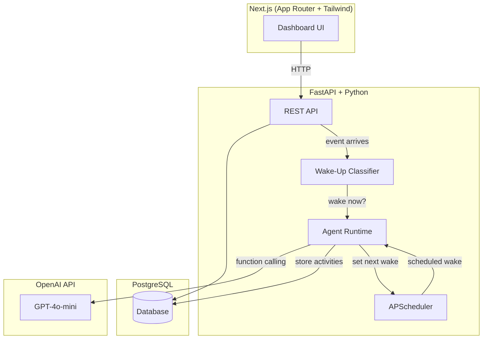

# Order Supervisor POC — Implementation Plan

## Goal

Build a POC for a **long-running AI supervisor** that oversees a single order from creation to completion. The system starts one run per order, receives events over time, uses an AI agent to reason/act/sleep, and produces a final summary upon completion.

---

## Architecture Overview



## Key Design Decisions

### 1. Orchestration: APScheduler + DB State (not Temporal/Celery)

**Why:** For a POC, Temporal adds enormous infrastructure complexity (Temporal server, SDK, workflow versioning). Celery requires a message broker (Redis/RabbitMQ). Instead, I'll use:

- **PostgreSQL** as the single source of truth for run state, wake-up times, and activity history.
- **APScheduler** (with SQLAlchemy job store) for scheduled wake-ups — it's lightweight, embeddable, and persists jobs to PG so they survive restarts.
- **In-process async execution** for agent inference triggered by events or scheduled wake-ups.

This gives us: long-running execution ✓, event-driven wake-up ✓, scheduled wake-up ✓, interruption ✓, reliable state transitions ✓ — all without external infrastructure beyond PostgreSQL.

### 2. LLM Orchestration: OpenAI Function Calling (direct)

**Why:** Frameworks like LangChain add abstraction layers that obscure what's happening. For a POC, direct OpenAI function calling with Pydantic tool schemas is clearer, more debuggable, and sufficient. The agent uses a tool-calling loop: call model → execute tool(s) → feed results back → repeat until done.

### 3. Wake-Up Classifier: Lightweight GPT-4o-mini call

**Why:** Rather than hard-coding event importance rules, a fast GPT-4o-mini call with the run's wake-up guidance determines whether an incoming event should wake the main agent. This is flexible and allows the main agent to refine future wake-up criteria.

### 4. State & Memory: JSON state blob + conversation history compaction

Each run stores:
- A **structured state JSON** (order status, flags, priorities, wake-up guidance)
- A **compacted conversation history** (last N activities + summaries of older ones)

The agent can update its state via a `update_state` tool, keeping it coherent across wake cycles.

---

## Monorepo Structure

```
order-supervisor-poc/
├── backend/
│   ├── app/
│   │   ├── __init__.py
│   │   ├── main.py              # FastAPI app + lifespan (APScheduler)
│   │   ├── config.py            # Settings via pydantic-settings
│   │   ├── database.py          # Async SQLAlchemy engine + session
│   │   ├── models.py            # SQLAlchemy ORM models
│   │   ├── schemas.py           # Pydantic request/response schemas
│   │   ├── api/
│   │   │   ├── __init__.py
│   │   │   ├── supervisors.py   # CRUD for supervisor configs
│   │   │   ├── runs.py          # Run lifecycle endpoints
│   │   │   └── events.py        # Event ingestion + simulator
│   │   ├── agent/
│   │   │   ├── __init__.py
│   │   │   ├── runtime.py       # Main agent loop (tool-calling)
│   │   │   ├── classifier.py    # Lightweight wake-up classifier
│   │   │   ├── tools.py         # Tool definitions + executors
│   │   │   └── prompts.py       # System prompts & templates
│   │   └── scheduler.py         # APScheduler setup + wake-up jobs
│   ├── alembic/                 # DB migrations
│   │   ├── env.py
│   │   └── versions/
│   ├── alembic.ini
│   ├── requirements.txt
│   └── .env.example
├── frontend/
│   ├── src/
│   │   ├── app/
│   │   │   ├── layout.tsx       # Root layout (dark theme, fonts)
│   │   │   ├── page.tsx         # Dashboard home
│   │   │   ├── supervisors/
│   │   │   │   ├── page.tsx     # List/create supervisors
│   │   │   │   └── [id]/
│   │   │   │       └── page.tsx # Supervisor detail
│   │   │   └── runs/
│   │   │       ├── page.tsx     # All runs list
│   │   │       └── [id]/
│   │   │           └── page.tsx # Run detail (history, state, controls)
│   │   ├── components/
│   │   │   ├── RunCard.tsx
│   │   │   ├── ActivityTimeline.tsx
│   │   │   ├── EventInjector.tsx
│   │   │   ├── StateViewer.tsx
│   │   │   ├── InstructionPanel.tsx
│   │   │   └── RunControls.tsx
│   │   └── lib/
│   │       └── api.ts           # Typed API client
│   ├── tailwind.config.ts
│   ├── package.json
│   └── .env.local
├── docker-compose.yml           # PostgreSQL + backend + frontend
└── README.md
```

---

## Database Schema

### `supervisors` table

| Column | Type | Description |
|--------|------|-------------|
| id | UUID (PK) | |
| name | VARCHAR(255) | Supervisor template name |
| base_instruction | TEXT | System prompt for the agent |
| available_actions | JSONB | List of enabled action names |
| default_wake_behavior | JSONB | Default wake-up config (interval, aggressiveness) |
| model_config | JSONB | Model name, temperature, etc. |
| wake_guidance | TEXT | Default guidance for the classifier |
| created_at | TIMESTAMP | |
| updated_at | TIMESTAMP | |

### `runs` table

| Column | Type | Description |
|--------|------|-------------|
| id | UUID (PK) | |
| supervisor_id | UUID (FK) | |
| order_id | VARCHAR(255) | External order identifier |
| status | ENUM | `running`, `sleeping`, `paused`, `completed`, `terminated` |
| state | JSONB | Agent's working memory (order status, flags, priorities) |
| wake_guidance | TEXT | Current classifier guidance (agent can update) |
| additional_instructions | TEXT[] | Run-specific instructions added over time |
| next_wake_at | TIMESTAMP | Scheduled next wake-up |
| max_end_at | TIMESTAMP | Hard deadline for run |
| final_summary | JSONB | End-of-run output (summary, actions, learnings, feedback) |
| created_at | TIMESTAMP | |
| updated_at | TIMESTAMP | |

### `activities` table (unified activity log)

| Column | Type | Description |
|--------|------|-------------|
| id | UUID (PK) | |
| run_id | UUID (FK) | |
| type | VARCHAR(50) | `event`, `wake_decision`, `sleep_decision`, `agent_action`, `agent_reasoning`, `instruction_added`, `state_update`, `final_output`, `system` |
| subtype | VARCHAR(100) | E.g., `message_customer`, `payment_confirmed`, `sleep_until` |
| content | JSONB | Payload (message text, event data, reasoning, etc.) |
| created_at | TIMESTAMP | |

---

## API Design

### Supervisors

| Method | Path | Description |
|--------|------|-------------|
| `POST` | `/api/supervisors` | Create supervisor config |
| `GET` | `/api/supervisors` | List all supervisor configs |
| `GET` | `/api/supervisors/{id}` | Get supervisor detail |
| `PUT` | `/api/supervisors/{id}` | Update supervisor config |

### Runs

| Method | Path | Description |
|--------|------|-------------|
| `POST` | `/api/runs` | Start a new run (requires supervisor_id + order_id) |
| `GET` | `/api/runs` | List runs (filter by status) |
| `GET` | `/api/runs/{run_id}` | Get run detail (state, config) |
| `GET` | `/api/runs/{run_id}/activities` | Get activity log (paginated) |
| `POST` | `/api/runs/{run_id}/events` | Inject an event into the run |
| `POST` | `/api/runs/{run_id}/instructions` | Add run-specific instruction |
| `POST` | `/api/runs/{run_id}/pause` | Pause the run |
| `POST` | `/api/runs/{run_id}/resume` | Resume the run |
| `POST` | `/api/runs/{run_id}/terminate` | Terminate the run |

### Event Simulator

| Method | Path | Description |
|--------|------|-------------|
| `POST` | `/api/simulator/scenario` | Fire a pre-built event sequence for testing |

---

## Agent Runtime Design

### Tool Definitions (OpenAI function calling)

```python
TOOLS = [
    # Business actions
    "message_fulfillment_team",   # Send message to fulfillment
    "message_payments_team",      # Send message to payments
    "message_logistics_team",     # Send message to logistics
    "message_customer",           # Send message to customer
    "create_internal_note",       # Create internal note

    # Runtime capabilities
    "sleep_until",                # Sleep until timestamp or for duration
    "update_state",               # Update the run's state JSON
    "set_wake_guidance",          # Update classifier guidance for future events
    "recommend_completion",       # Agent recommends run completion (system decides)
]
```

### Agent Loop (per wake cycle)

```
1. Load run from DB (state, recent activities, instructions)
2. Build system prompt (base instruction + additional instructions + state + recent history)
3. Call OpenAI with tools
4. Execute tool calls → store as activities
5. Feed tool results back to model
6. Repeat 3-5 until model stops calling tools
7. Record agent reasoning as activity
8. If agent called sleep_until → update run.next_wake_at, set status=sleeping
9. If terminal event received → trigger final summary generation → set status=completed
```

### Wake-Up Classifier

```
1. Receive event for a run
2. Load run's wake_guidance
3. Call GPT-4o-mini: "Given this guidance and this event, should the main agent wake up? Return {wake: bool, reason: string}"
4. If wake=true → trigger agent runtime
5. If wake=false → store event as activity, keep run sleeping
6. Always wake for: order_created, delivered, refund_requested (hard-coded overrides)
```

### Run Completion Rules (system-owned)

- Terminal events: `delivered`, `refund_requested` (after resolution) → trigger final summary then complete
- Manual termination from UI → trigger final summary then terminate
- Max run age reached (default: 72h simulated) → trigger final summary then complete
- Agent's `recommend_completion` tool → checked against system rules before acting

---

## Frontend Pages

### 1. Dashboard (`/`)
- Summary cards: active runs, completed runs, total events processed
- Recent activity feed across all runs
- Quick-start button to create a new run

### 2. Supervisors (`/supervisors`)
- List of supervisor templates as cards
- Create/edit supervisor modal with form fields for all config
- Pre-seeded with 2 hardcoded templates:
  - **Standard Order Supervisor** — balanced wake aggressiveness
  - **High-Priority Supervisor** — aggressive wake-up, faster escalation

### 3. Runs List (`/runs`)
- Filterable table of all runs
- Status badges (running/sleeping/paused/completed/terminated)
- Sort by creation date, last activity

### 4. Run Detail (`/runs/[id]`) — **Main view**
- **Header**: Run status, order ID, supervisor name, timestamps
- **Activity Timeline**: Scrollable chronological log with color-coded entries (events, actions, reasoning, sleep/wake decisions)
- **Current State**: JSON viewer showing agent's working memory
- **Event Injector Panel**: Dropdown of event types + custom payload → fire event
- **Instructions Panel**: Add run-specific instructions, see existing ones
- **Run Controls**: Pause / Resume / Terminate buttons

### UI Design
- Dark theme with glassmorphism cards
- Color palette: deep navy (#0f172a) → slate blues → vibrant accent (cyan/emerald for actions, amber for warnings, rose for errors)
- Inter font family
- Smooth transitions and micro-animations (status changes, new activities appearing)
- Responsive layout

---

## Proposed Changes

### Backend Setup

#### [NEW] [requirements.txt](file:///c:/order-supervisor-poc/backend/requirements.txt)
Dependencies: `fastapi`, `uvicorn[standard]`, `sqlalchemy[asyncio]`, `asyncpg`, `alembic`, `pydantic-settings`, `openai`, `apscheduler`, `python-dotenv`, `httpx`

#### [NEW] [config.py](file:///c:/order-supervisor-poc/backend/app/config.py)
Pydantic Settings class loading from `.env`: DATABASE_URL, OPENAI_API_KEY, model names, max run age, etc.

#### [NEW] [database.py](file:///c:/order-supervisor-poc/backend/app/database.py)
Async SQLAlchemy engine + session factory + `get_db` dependency.

#### [NEW] [models.py](file:///c:/order-supervisor-poc/backend/app/models.py)
SQLAlchemy ORM models for `supervisors`, `runs`, `activities` tables as described in the schema above.

#### [NEW] [schemas.py](file:///c:/order-supervisor-poc/backend/app/schemas.py)
Pydantic schemas for all API request/response models.

#### [NEW] [main.py](file:///c:/order-supervisor-poc/backend/app/main.py)
FastAPI app with lifespan handler (starts/stops APScheduler), CORS middleware, includes all routers.

---

### API Routes

#### [NEW] [supervisors.py](file:///c:/order-supervisor-poc/backend/app/api/supervisors.py)
CRUD endpoints for supervisor configs. Seeds default templates on first request if none exist.

#### [NEW] [runs.py](file:///c:/order-supervisor-poc/backend/app/api/runs.py)
Run lifecycle: create (triggers agent start), list, get detail, get activities, add instructions, pause/resume/terminate.

#### [NEW] [events.py](file:///c:/order-supervisor-poc/backend/app/api/events.py)
Event ingestion endpoint + event simulator endpoint. Events go through classifier before waking agent.

---

### Agent Runtime

#### [NEW] [runtime.py](file:///c:/order-supervisor-poc/backend/app/agent/runtime.py)
Main agent loop: loads context → builds prompt → iterates with OpenAI function calling → executes tools → stores activities → handles sleep/completion.

#### [NEW] [classifier.py](file:///c:/order-supervisor-poc/backend/app/agent/classifier.py)
Lightweight GPT-4o-mini classifier that checks incoming events against run's wake guidance.

#### [NEW] [tools.py](file:///c:/order-supervisor-poc/backend/app/agent/tools.py)
Tool definitions (OpenAI function schemas) + executor functions. Each business action creates an activity record.

#### [NEW] [prompts.py](file:///c:/order-supervisor-poc/backend/app/agent/prompts.py)
System prompt templates for main agent and classifier.

---

### Scheduler

#### [NEW] [scheduler.py](file:///c:/order-supervisor-poc/backend/app/scheduler.py)
APScheduler configuration with SQLAlchemy job store. Functions to schedule/cancel wake-up jobs per run.

---

### Database Migrations

#### [NEW] Alembic setup
`alembic.ini` + `env.py` + initial migration creating all three tables.

---

### Frontend Setup

#### [NEW] Next.js App (initialized with `create-next-app`)
App Router, TypeScript, Tailwind CSS, ESLint.

#### [NEW] [api.ts](file:///c:/order-supervisor-poc/frontend/src/lib/api.ts)
Typed fetch wrapper for all backend endpoints.

#### [NEW] [layout.tsx](file:///c:/order-supervisor-poc/frontend/src/app/layout.tsx)
Root layout: dark theme, Inter font, sidebar navigation.

#### [NEW] [page.tsx](file:///c:/order-supervisor-poc/frontend/src/app/page.tsx)
Dashboard with summary cards and recent activity.

#### [NEW] Supervisors pages
List + create/edit supervisor templates.

#### [NEW] Runs pages
List all runs + detailed run view with timeline, state viewer, event injector, instructions panel, and controls.

#### [NEW] Components
`RunCard`, `ActivityTimeline`, `EventInjector`, `StateViewer`, `InstructionPanel`, `RunControls`.

---

### Infrastructure

#### [NEW] [docker-compose.yml](file:///c:/order-supervisor-poc/docker-compose.yml)
Services: PostgreSQL (port 5432), backend (port 8000), frontend (port 3000).

#### [NEW] [.env.example](file:///c:/order-supervisor-poc/.env.example)
Template for required environment variables.

---

## Open Questions

> [!IMPORTANT]
> **OpenAI API Key**: Do you have an OpenAI API key available? The agent uses GPT-4o-mini for both the main agent and the classifier. If you prefer a different LLM provider (Anthropic, Google, local models via Ollama), I can adapt the implementation.

> [!IMPORTANT]
> **PostgreSQL**: Do you have a PostgreSQL instance available, or should I include Docker Compose to spin one up locally? The plan currently includes a `docker-compose.yml` for this.

> [!NOTE]
> **Tailwind CSS Version**: The requirements say Tailwind CSS for the UI. I'll use **Tailwind CSS v4** (latest) with the Next.js integration. Let me know if you prefer v3.

---

## Verification Plan

### Automated Tests

1. **Backend startup**: `uvicorn` starts without errors, migrations apply cleanly
2. **API smoke tests**: Use `httpx` to hit all endpoints and verify responses
3. **Agent loop test**: Create a run → inject events → verify activities are stored → verify agent reasoning appears in log
4. **Scheduler test**: Verify that a sleeping run wakes up when its scheduled time arrives
5. **Completion test**: Send `delivered` event → verify final summary is generated → run status becomes `completed`

### Browser Verification

1. Navigate to dashboard → verify summary cards render
2. Create a supervisor template → verify it appears in list
3. Start a run → verify it appears as "running"
4. Inject events via UI → verify timeline updates
5. Add instructions → verify they appear in context
6. Pause/resume/terminate → verify status changes
7. Wait for agent to process → verify actions appear in timeline
8. Complete a run → verify final summary is displayed

### End-to-End Scenario

1. Create a supervisor with default config
2. Start a run for order "ORD-001"
3. Fire events: `order_created` → `payment_confirmed` → `shipment_created` → `shipment_delayed` → `delivered`
4. Verify the agent:
   - Wakes on each relevant event
   - Takes appropriate actions (messages teams, creates notes)
   - Sleeps between events
   - Produces a final summary with learnings
